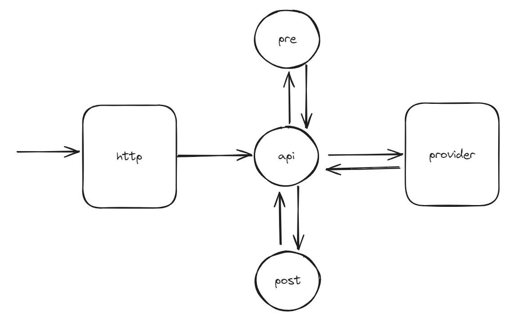

# Proof of concept (POC)



The application has two endpoints
* http
* nats

## Http endpoint

Some example API calls

```bash
curl -X GET localhost:8081/prefetch/wamli-mobilenetv27%3Alatest

curl -T ../data/imagenet/cat.jpg localhost:8081/preprocessing-only/wamli-mobilenetv27%3Alatest

curl -T ../data/imagenet/cat.jpg localhost:8081/wamli-mobilenetv27%3Alatest
```

## NATS endpoint

Experimental for now, just returning an echo. Some example API calls,
requires [NATS-cli](https://github.com/nats-io/natscli) to be installed 

```bash
nats req "wasmcloud.echo" "HELLLLOOOOOO"

# Sending a file
nats req "wasmcloud.echo" "$(cat ../data/imagenet/cat.jpg)"
```